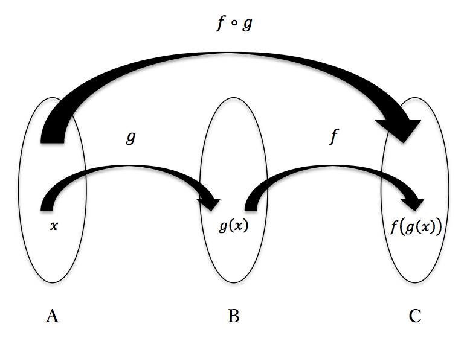

# 3. Why Functional Programming?

## 함수형 프로그래밍이 중요한 이유

앞에서 설명했다시피 함수형 프로그래밍은 전혀 새로운 것이 아닙니다.
역사에 대해서는 후술하겠지만 이론적 배경인 Lambda Calculus는 1930년대에 나왔고
지금 가장 유명한 함수형 언어인 Haskell조차 1990년에 등장하였습니다.
하지만 지금, 그 어느 때보다도 유례없이 함수형 프로그래밍의 중요성이 부각되고 있는데
그 이유에 대해 알아보도록 합시다.

### 무어의 법칙의 붕괴

> The complexity for minimum component costs has increased at a rate of roughly a factor of two per year ... 
Certainly over the short term this rate can be expected to continue, if not to increase. 
Over the longer term, the rate of increase is a bit more uncertain, 
although there is no reason to believe it will not remain nearly constant for at least 10 years. 
That means by 1975, the number of components per integrated circuit for minimum cost will be 65,000. 
I believe that such a large circuit can be built on a single wafer.[^1]

무어의 법칙이란, 반도체 집적회로의 성능, 즉 컴퓨팅 성능이 24개월마다 2배로 증가한다는 법칙입니다.
오로지 귀납적 추론에 근거하므로 사실 법칙이라고 거창하게 이름 붙일 것은 아닙니다만, 이상하리만치
잘 맞아왔던 법칙입니다. ~~(항간에는 이 법칙을 맞추려 공대생들을 갈아넣는다는 소문이..)~~

하지만 2010년대에 들어와서 무어의 법칙은 50년 동안의 전통을 깨고 종말을 고했습니다.
특히 최근엔 10nm 공정에 들어서면서 여러가지 파열음이 나오며 더더욱 집적도 향상은 기대하기 어려워졌죠.
CPU 회사들은 자체적으로 무어의 법칙을 따르지 않겠다 선언하고 싱글 코어의 성능향상보다는 코어 수를 늘리는 것에
집중하고 있고 그동안 그래픽에나 쓰이던 GPU가 계산계의 신성으로 떠오르는 등 하드웨어 업계는
엄청난 변화의 바람에 휩싸여 있습니다.
그리고 이러한 하드웨어 패러다임의 변화는 당연하게도 프로그래밍 패러다임에 영향을 줍니다.

무어의 법칙은 프로그래머에게 굉장히 훌륭한 법칙이었습니다.
프로그래머는 그저 싱글 코어로 잘 돌아가는 코드를 짜놓으면 24개월마다 하드웨어가 업그레이드 되며
코드 역시 성능이 2배 향상되었습니다. 그야말로 공짜 점심이었죠.
하지만, 정보 및 데이터의 양은 압도적으로 늘어가는데 코어의 쿨럭 향상은 크게 기대할 수 없는 상황이 되었습니다.
이러한 시대에 아직도 싱글코어를 고집하면 자연스럽게 도태될 수 밖에 없습니다.
이제 프로그래머들은 필연적으로 병렬 혹은 병행 프로그래밍의 세계에 뛰어들 수 밖에 없어졌습니다.
그렇게 다시 희망이 보이는 듯 했지만 문제가 하나 생겼습니다.

### Deadlock


데드락은 병렬 프로그래밍을 해본 사람이라면 꼭 한 번쯤은 겪었을 문제입니다.
스레드나 코어가 어떠한 데이터를 다루고 있을 때, 안전하게 작업하기 위하여 다른 스레드나 코어들은 접근할 수 없게
잠금(Lock)을 겁니다. 한 번 락이 걸리면 그것이 풀릴 때까지 다른 스레드나 코어들은 그 데이터에 접근할 수 없게 되는데
문제는 여러 스레드가 동시에 여러 데이터에 락을 걸어버리면 모두 눈치보느라 영원히 락이 풀리지 않는 현상이 생깁니다. 
그것이 바로 데드락입니다. 이는 현대 프로그래밍에서 가장 중요한 문제 중 하나이고 따라서 이미 여러 해답들이 제시되었습니다.
재미있는 것은 프로그래밍 언어에 따라 이 해결 방법이 다른데 이에 대해 간략히 소개하면 다음과 같습니다.

* Python: GIL(Global Interpreter Lock) - 한 번에 하나의 락만 허용되게 하여 데드락이 발생하지 않음
* JS, Java, C#, Go and etc.: Async(비동기) - 직접적인 해답은 아니지만, 나머지 스레드들이 대기하고 있는 것이 아니라 비동기적으로 실행함으로 데드락을 우회.
* Rust: Ownership(소유권) - 값의 대입이 일어날 때, 소유권을 전달함으로서 동일한 자료로의 접근 자체를 제한한다.

이들 방법은 여러모로 다르지만 공통적인 특징은 성능과 편안함 중에 하나만 골라야 된다는 것입니다.
예를 들어 Python의 GIL은 상당히 편하지만 성능은 좋지 않습니다. 반대로 Rust의 소유권 개념은 비용없는 추상화까지 지원하며 압도적인 성능을 보여주지만
진입장벽이 무척 높을 정도로 불편합니다. 이에 대하여 Haskell을 위시한 함수형 언어들은 기묘한 대안을 제시합니다.

* Functional Programming: Immutable - 모든 자료가 불변이라 데이터의 변경자체가 존재하지 않으므로 이론적으로 완벽한 병렬의 구현이 가능.

이미 불변성에 대해서는 간략히 다뤘었으니 부가적인 설명은 하지 않겠지만, 병렬 프로그래밍에 있어서 불변성은 대단한 안정성을 제공해줍니다.
특히 사용자에 의해 선택되는 불변성이 아니라 언어에 의해 강제되는 불변성은 더더욱 큰 의의를 갖죠.
예를 들어 다음 코드를 봅시다.

```python
# python3
x = a + b

#----중간 생략----

y = a + b
```

위의 코드에서의 x와 y는 겉보기엔 같아보이지만 중간에 생략되어 있는 부분의 코드에 따라
x와 y는 다를 수 있습니다. 내가 그렇게 안 짜면 되지 않냐 할 수 있지만 컴파일러나 인터프리터의 입장에서는
사용자가 어떻게 했는지는 일일이 다 뒤져봐야 하는 것이죠.
하지만 위 언어가 Haskell 같은 순수 함수형 언어였다면 x와 y는 중간에 무엇이 생략되던 간에 항상 같습니다.
따라서 처리계가 최적화하기 쉬워지죠. 병렬에 있어서는 두말할 것도 없구요.

## 이렇게 좋다면 그동안 왜 안 썼나?

함수형 프로그래밍 얘기를 꺼내면 항상 나오는 반박이 있습니다. 그렇게 좋다면 왜 안 쓰고 있었냐는 반박이죠.
함수형 프로그래밍의 논리적 기반은 아주 탄탄하게 짜여 있습니다. 유명한 상업용 함수형 언어인 Haskell 역시 수학회가 만들었죠.
하지만 이론과 현실은 엄연히 다릅니다. 아이디어가 좋다고 그것의 실현 역시 좋을 것이라 낙관하면 안되는 법이죠.

### 추상화는 사람과 언어 모두에 의존

함수형 언어의 핵심 부분인 **추상화**는 사람 뿐만 아니라 언어에도 역시나 의존하게 됩니다.
따라서 사람의 아이디어가 아무리 혁명적인 것이라 해도 그것을 처리하는 언어가 지원하지 않는 기능이거나
실행성능이 저조하면 아무도 그 아이디어를 차용하지 않을 것입니다.
특히 고급 추상화 기능은 필연적으로 비용을 지불하게 됩니다.[^2] 문제는 이전까지 CPU의 성능이 이 비용을 지불할 여유가 되지 않았다는 것입니다.
따라서 CPU 성능이 뛰어난 지금에 이르러서야 함수형 패러다임이 수면 위로 올라온 거이죠.

### 최적화의 중요성

프로그래밍에 있어서 최적화는 매우 중요한 요소입니다. 하지만 위에서 말했다시피 과거에는 CPU의 성능이 낮아 추상화도 제대로 못 시켰으니 최적화는 생각도 못했죠.
따라서 프로그래머들은 프로세서의 구조대로 명령형으로 질의해야 했습니다. 하지만 요즘의 CPU 성능은 컴파일러에 최적화를 맡기는 것이 좋을 만큼 엄청난 성능을 자랑하고 있습니다.
가장 쉬운 예로 1 부터 n까지 더하는 함수를 생각해봅시다.

```c
// C (C99)
int totalFrom1To(int n) {
  int result = 0;
  for (int i = 1; i <= n; result += i++);
  return result;
}
```

위의 코드는 전형적인 명령형 언어인 C의 코드입니다. 우리에게 너무나 익숙한 형태죠.
반면, 함수형 언어인 Haskell은 다음과 같은 코드를 보여줍니다.

```haskell
totalFrom1To = sum . enumFromTo 1
```

코드가 낯설 수 있으니 설명을 보태자면 `enumFromTo`라는 함수는 어떤 수부터 시작하는 리스트를 생성하는 함수입니다.
중간에 `.`은 합성함수 기호를 나타내므로 이 코드는 1부터 시작하는 배열을 만든 뒤, 합하라는 코드인 셈이죠.
당연하게도 이러한 방식은 매우 비효율적으로 보여집니다. 배열을 만드는 비용이 무시할 수준이 아니니까요.
따라서 최적화가 없는 코드의 수행은 다음과 같이 매우 비효율적입니다.

```haskell
-- 최적화 갖다 버린 코드
sum (enumFromTo 1 5)
=> sum (1 : enumFromTo 2 5)
=> sum (1 : 2 : enumFromTo 3 5)
..
=> sum (1 : 2 : 3 : 4 : 5 : [])
=> 1 + sum (2 : 3 : 4 : 5 : [])
..
=> 1 + (2 + (3 + (4 + (5 + 0))))
=> 15
```

배열을 먼저 생성한 후에야 iteration을 하면서 더하는 코드니 당연히 시간은 두 배 소요되죠.
이렇게 되면 아무도 이 코드를 사용하지 않을 것입니다. 하지만 인간이 만든 가장 위대한 추상화 및 최적화 도구인 수학을 차용한 컴파일러는 다음과 같은 마법을 보여줍니다.

```haskell
-- 최적화된 코드
sum (enumFromTo 1 5)
=> 1 + sum (enumFromTo 2 5)
=> 1 + (2 + sum (enumFromTo 3 5))
..
=> 1 + (2 + (3 + (4 + (5 + 0))))
=> 15
```

배열을 만드는 `enumFromTo`와 배열을 더하는 `sum`을 합성했더니 중간단계의 `List`가 사라져 버렸습니다.
마치 수학에서의 합성함수를 보는 듯 합니다. 실제로 함수형 언어들은 수학을 강하게 사용하고 있으므로
이런 마법과 같은 일은 비일비재한 일입니다.



따라서 Haskell의 경우에는 컴파일단계에서의 최적화 옵션에 따라 실행시간이 수배에서 수십배까지 차이가 납니다.

다음 장에서는 함수형 프로그래밍의 역사와 종류에 대해 다뤄보겠습니다.

[^1]: Moore, Gordon E. (1965-04-19). "Cramming more components onto integrated circuits". Electronics. Retrieved 2016-07-01.
[^2]: Rust 언어는 비용 없는 추상화로 각광 받고 있는데 완전한 고급 추상화가 아니기에 CPU의 비용은 없어도 인간의 비용이 들게 됩니다.
